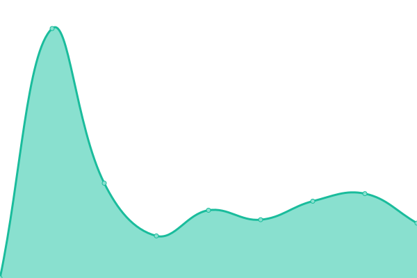

# [📈 Live Status](https://status.imap.fi): <!--live status--> **Kaikki palvelut toimivat**

This repository contains the open-source uptime monitor and status page for [imap-fi](https://status.imap.fi), powered by [Upptime](https://github.com/upptime/upptime).

With [Upptime](https://upptime.js.org), you can get your own unlimited and free uptime monitor and status page, powered entirely by a GitHub repository. We use [Issues](https://github.com/imap-fi/status/issues) as incident reports, [Actions](https://github.com/imap-fi/status/actions) as uptime monitors, and [Pages](https://status.imap.fi) for the status page.

<!--start: status pages-->
<!-- This summary is generated by Upptime (https://github.com/upptime/upptime) -->
<!-- Do not edit this manually, your changes will be overwritten -->
<!-- prettier-ignore -->
| URL | Status | History | Response Time | Uptime |
| --- | ------ | ------- | ------------- | ------ |
|  [Sivusto](https://imap.fi) | Päällä | [sivusto.yml](https://github.com/imap-fi/status/commits/HEAD/history/sivusto.yml) | 

 301ms
     
 | 

<a href="https://status.imap.fi/history/sivusto">100.00%</a>
    

|  [Palvelun API](https://api.imap.fi/heartbeat) | Päällä | [palvelun-api.yml](https://github.com/imap-fi/status/commits/HEAD/history/palvelun-api.yml) | 

 861ms
     
 | 

<a href="https://status.imap.fi/history/palvelun-api">100.00%</a>
    

|  [Sähköpostipalvelin](https://server.imap.fi) | Päällä | [saehkoepostipalvelin.yml](https://github.com/imap-fi/status/commits/HEAD/history/saehkoepostipalvelin.yml) | 

 997ms
     
 | 

<a href="https://status.imap.fi/history/saehkoepostipalvelin">100.00%</a>
    

|  [Webmail](https://mail.imap.fi) | Päällä | [webmail.yml](https://github.com/imap-fi/status/commits/HEAD/history/webmail.yml) | 

 599ms
     
 | 

<a href="https://status.imap.fi/history/webmail">100.00%</a>
    

<!--end: status pages-->

[**Visit our status website →**](https://status.imap.fi)

## 📄 License

- Powered by: [Upptime](https://github.com/upptime/upptime)
- Code: [MIT](./LICENSE) © [imap-fi](https://status.imap.fi)
- Data in the `./history` directory: [Open Database License](https://opendatacommons.org/licenses/odbl/1-0/)
